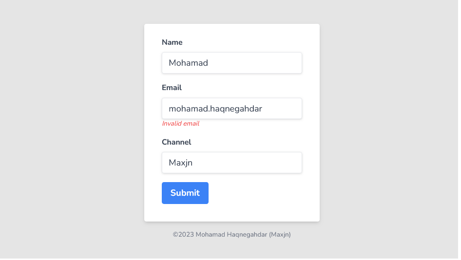

# Portfolio Blog - Nextjs v13.4.1

This is a practical [Next.js](https://nextjs.org/) project bootstrapped with [`create-next-app`](https://github.com/vercel/next.js/tree/canary/packages/create-next-app) for practicing **Formik** and **Yup** libraries.

Explore the [demo](https://maxjn-formik-tut.vercel.app/) for better understanding'.

## Technologies

- TSX, Tailwindcss,
- TypeScript
- **Nextjs v13.4.1**
- **Packages:** fFormik, Yup
- **Routing:** useing new app directory

## Features

- Introduction to Formik
- useFormik
- Managing form state
- Handling form submission
- Validation & displaying errors
- Customizing form and controls
- Reusable form and controls

## Installation

###### shell command

```shell
npm install

npm run dev
```

## Screenshots


